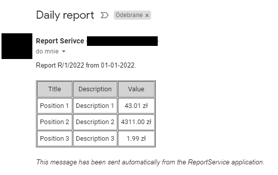
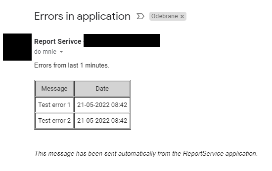
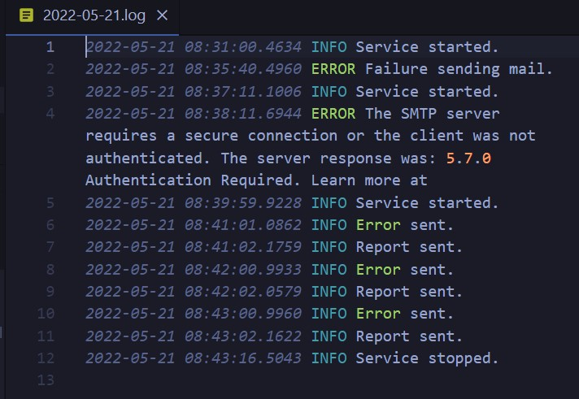
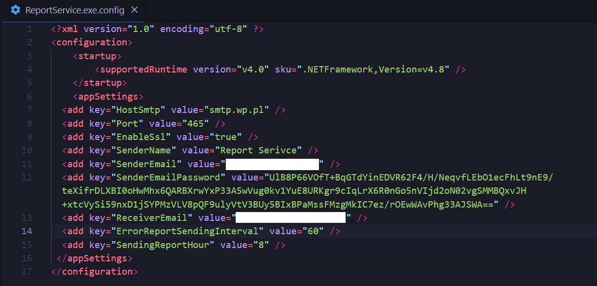

# Report Service

A service that sends reports to your mailbox at a specified hour.
A report containing errors will be sent regularly in specified intervals if any error occurred.

Your mailbox password will be encrypted after the first service run.

# Note
 
This is an educational project. Getting report real data from external databases is missing.

## Requirements
- OS: Windows
- .NET Framework 4.8

## How to use?

### Installation
0. Download the file from [github release page](https://github.com/Tymisko/report-service/releases) and extract it.
1. Set the configuration data in ReportService.exe.config:
    - fill your mailbox settings (by default SMTP is set to Gmail)
    - your password must have `encrypt:` prefix
    - Enter your error report sending interval (in minutes)
    - Enter your sending report hour.
2. Open terminal as administrator
3. Navigate to the folder where you extracted the app.
4. Run the `ReportService.exe --install` command.
5. Open "services.msc"
6. Find ReportService 
7. Righ Mouse Button and choose "start service".

### Uninstallation
1. Open a terminal
2. Navigate to the app folder
3. Run `ReportService --uninstall`

## Presentation

